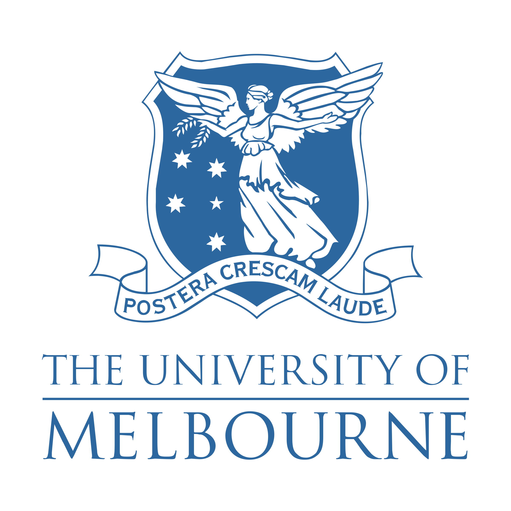
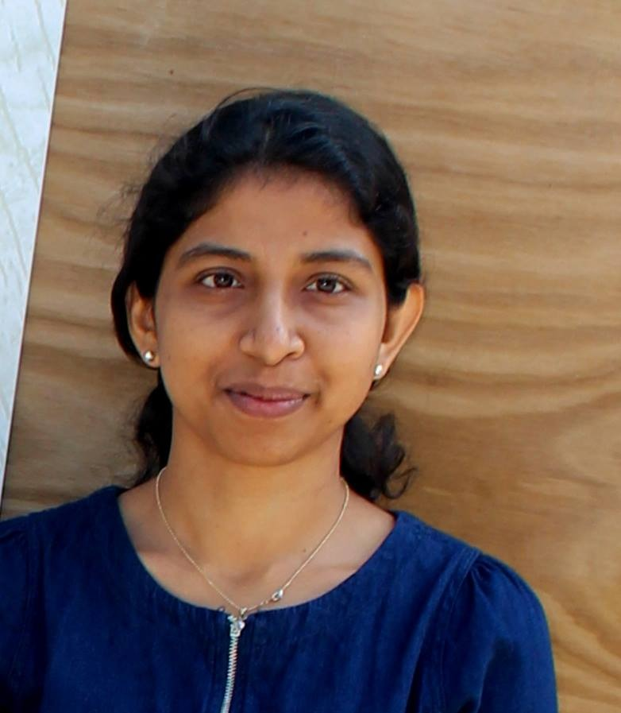

.
# Overview
Data engineering has contributed immensely to the advancement of biology and medicine. Various AI-based solutions are proposed and implemented for decision-making. However, the widespread adoption of AI as a frequent tool in decision-making that has tangible impacts on patient well-being is still far from achieving its potential due to the controversy of outsourcing the health and medical decision-making processes to black-box AI methods. Therefore, fairness and explainability are two factors that are desirable by biologists and medical practitioners. Recent research has focused on producing AI methods that are both transparent and can cater to improving societal equity in their respective domains. With this in mind, we consider the advances made in fairness and explainability of AI in medical and biological applications. We conceive it vital that they are considered in generalisable engineering solutions. Accordingly, this workshop focuses on methods suitable for developing fair and explainable AI-based solutions for biology and medicine.

**The workshop will be held virtually on 29th July 2022.**  **REGISTRATION IS FREE** 

# Invited Speakers

## <a href="https://findanexpert.unimelb.edu.au/profile/2854-saman-halgamuge" target="_blank">Prof Saman Halgamuge</a> 
 **The University of Melbourne, Australia** 

<table>
  <tr>
   <td width="30%"></td>
    <td>Prof Saman Halgamuge is a Fellow of IEEE, a Professor in the School of Electrical, Mechanical and Infrastructure Engineering and a Distinguished Lecturer of IEEE for Computational Intelligence (2019-2021). He served as Director/Head, Research School of Engineering of the Australian National University (ANU) (2016-18), a member of Australian Research Council (ARC) College of Experts for Engineering, Information and Computing Sciences (2016-18), the founding Director of the PhD training centre Melbourne India Postgraduate Program (MIPP) of University of Melbourne and Associate Dean (2013-15) and Assistant Dean (2008-13) in International Engagement in the Melbourne School of Engineering.</td>
  </tr>
</table>

## <a href="https://rajithv.com" target="_blank">Dr Rajith Vidanaarachchi</a> 
 **The University of Melbourne, Australia** 

<table>
  <tr>
  <td width="30%"></td>
    <td>  Dr. Rajith Vidanaraarachchi  completed his Bachelor of Science (Hons) at the University of Moratuwa, Sri Lanka, at the Department of Computer Science and Engineering. He commenced his PhD in Data Engineering under the supervision of Prof. Saman Halgamuge at the College of Engineering and Computer Science,  Australian National University. His PhD work is focused on gathering information from complex, heterogeneous data, and on inferring microbial interactions from time series metagenomic data. This has use cases in gut health and other biological/ecological areas. He is now a Research Fellow jointly at the Transport, Health, and Urban Design Research Lab at the Melbourne School of Design, and at the Optimisation and Pattern Recognition Research Lab at the Department of Mechanical Engineering.</td>

  </tr>
</table>

## <a href="https://findanexpert.unimelb.edu.au/profile/850537-damith-asanka-senanayake" target="_blank">Dr Damith Senanayake</a> 
 **The University of Melbourne, Australia** 

<table>
  <tr>
  <td width="30%"></td>
    <td>  Damith Senanayake is a postdoctoral research fellow with the departments of Biomedical Engineering and Mechanical Engineering at the University of Melbourne. He holds a PhD from University of Melbourne in Engineering, specializing in Machine Learning and Artificial Intelligence as applied in biological data analysis. His work prominently focuses on unsupervised learning of structural information from high-diemnsional biological data and efficient joint angle derivations from wearable sensors using contemporary deep learning techniques. He graduated from the University of Moratuwa with a Bachelors Degree in Computer Science and Engineering in 2015.</td>

  </tr>
</table>

## <a href="http://www.ce.pdn.ac.lk/academic-staff/damayanthi-herath/" target="_blank">Dr Damayanthi Herath</a> 
 **University of Peradeniya, Sri Lanka** 

<table>
  <tr>
  <td width="30%"></td>
    <td>  Damayanthi Herath graduated with a B.Sc. (Hons) in Computer Engineering, University of Peradeniya. She was a member of the Optimisation and Pattern Recognition Research Group of Melbourne School of Engineering, Australia where she worked on computational models and methods to profile inherently diverse DNA sequencing data which encode genetic information of multiple species and organisms. She is currently a senior lecturer at the Department of Computer Engineering, University of Peradeniya. Her research interests are in applied machine learning, especially in areas with social impact/aspect.</td>

  </tr>
</table>

## <a href="https://www.wehi.edu.au/people/shalin-naik" target="_blank">A/Prof Shalin Naik</a> 
 **The University of Melbourne, Australia** 

<table>
  <tr>
  <td width="30%"></td>
    <td>  Assoc Prof Naik is a graduate of the University of QLD (Microbiology &amp; Biochemistry) and did his PhD at WEHI. After his postdoc at the Netherlands Cancer Institute, where he developed next-gen cellular barcoding, he returned to WEHI in 2013, where he was later appointed as a Laboratory Head in the Immunology Division. They use single cell and clonal systems biology to investigate immunology, cancer and development. Dr Naik has also had several forays into science communication including as co-host of Ask the Doctor, Catalyst, Searching for Superhuman and The Great Acceleration on the ABC. More recently he started a podcast called The Jab Gab, which pairs comedians, scientists and doctors to talk about all things COVID, vaccines and your immune system.</td>

  </tr>
</table>

## <a href="https://www.ransalu.com/" target="_blank">Dr Ransalu Senanayake</a>
**Stanford University, USA**

<table>
  <tr>
    <td width="30%"></td>
    <td>Ransalu Senanayake is a postdoctoral research scholar in the Machine Learning Group at the Department of Computer Science, Stanford University. Working at the intersection of modeling and decision-making, he focuses on making autonomous systems equipped with ML algorithms trustworthy. Prior to joining Stanford, Ransalu obtained a Ph.D. in Computer Science from the University of Sydney in 2019. He has been an Associate Editor for the IEEE International Conference on Intelligent Robots and Systems (IROS) since 2021.</td>
  </tr>
</table>

## <a href="https://msd.unimelb.edu.au/about/our-people/academic/sachith-seneviratne" target="_blank">Dr Sachith Seneviratne</a> 
 **The University of Melbourne, Australia** 

<table>
  <tr>
    <td width="30%"></td>
    <td>Dr Sachith Seneviratne is an Artificial Intelligence specialist with a background in Software Engineering. His research in Machine Learning has led to many high quality publications in Artificial Intelligence, Computer Vision, Transport, Urban Design and Ecology. Sachith's PhD in Machine Learning (Monash University, Australia) explored the automation of machine learning models by automatically generating parallelized inference algorithms and code from model specifications and broadly incorporated the areas of Machine Learning, Software Engineering, Symbolic Computing, Compiler Theory and Distributed Systems. Sachith's current research work revolves around Deep Learning, with a focus on Contrastive Representation Learning and applications. He is also broadly interested in Applications of Computer Vision and Agent Based modelling, including Generative Design and Automated Architectural/Transport and Landscape Design. Sachith was previously a Research Assistant at RMIT (Agent based modelling) and has performed machine learning consulting for NASA, Harvard University and Currnt. </td>
  </tr>
</table>

# Workshop Schedule
All times are in the Indian Standard Time (IST) zone. \
*Topics of the invited talkes might be changed by the speaker*

| Time         | Session | Speaker/s |
| ------------------ | ----------------- | ------------------------ |
||||
| 08:30 - 08:05 | Introductions | Dr Damayanthi Herath |
| 08:05 - 08:35 | FAIR AI | Prof Saman Halgamuge |
| 08:35 - 09:05 | Fairness in Medicine and Biology | Dr Rajith Vidanaarachchi |
| 09:05 - 09:35 | Explainability in Medicine and Biology | Dr Damith Senanayake |
| 09:35 - 10:20 | Discussion on Open Problems | Moderated by Dr Damith Senanayake |
| 10:20 - 11:05 | Panel Discussion | Moderated by Dr Damayanthi Herath |
| 11:05 - 11:10 | Wrap up | Dr Damayanthi Herath |

